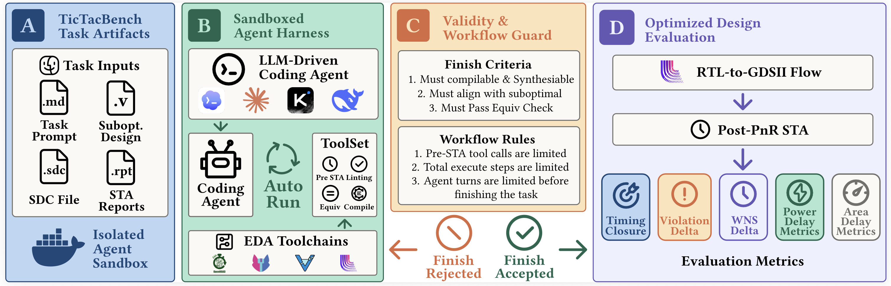
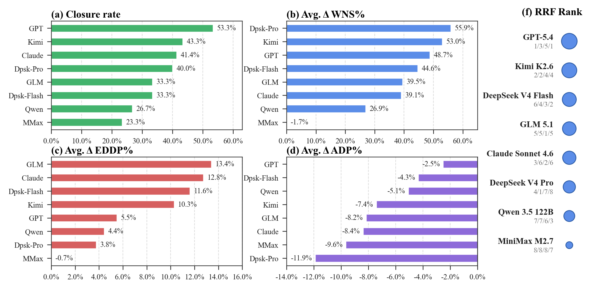

# TicTacBench: Benchmarking Timing Closure Capabilities of Coding Agents

[](assets/TicTacBench.pdf)
[](https://deno.com/)

TicTacBench is a benchmark for evaluating whether coding agents can repair RTL
setup-timing violations and achieve **post-place-and-route (post-PnR) timing
closure**. Unlike benchmarks based only on simulation or synthesis-stage quality
of results, TicTacBench evaluates the final RTL with a reproducible open-source
physical-design flow.

The benchmark contains **30 tasks**. Each task provides a suboptimal RTL design,
timing constraints, formal-equivalence artifacts, and pre-/post-PnR timing
evidence. The included agent harness lets a model inspect reports, edit RTL, run
compilation and equivalence checks, and use limited pre-PnR STA before the final
post-PnR evaluation.

> **Paper:**
> [TicTacBench: Benchmarking Timing Closure Capabilities of Coding Agents](assets/TicTacBench.pdf)
> · [arXiv:2609.23363](https://arxiv.org/abs/2609.23363)

> **Special thanks:**
>
> [RTLLM: An Open-Source Benchmark for Design RTL Generation with Large Language Model](https://github.com/hkust-zhiyao/RTLLM)
>
> [RTL-OPT: A Benchmark for RTL Code Optimization](https://github.com/hkust-zhiyao/RTL-OPT)

## Highlights



- Post-PnR timing closure is the primary target, rather than a synthesis-only
  proxy.
- 30 arithmetic, datapath, control, and pipelined RTL optimization tasks.
- Interface, synthesizability, functional equivalence, and latency guards.
- Four benchmark metrics: Timing Closure Rate, WNS improvement, EDDP
  improvement, and ADP improvement.
- **TicTacSkill**, a reusable timing-closure skill derived from observed agent
  failure modes.

## Benchmark Results



The paper evaluates coding agents driven by eight frontier LLMs over more than
300 runs. The strongest baseline, GPT-5.4, closes **53.3%** of the tasks. Across
the evaluated agents, timing improvements often come with an area cost, showing
that timing closure remains substantially harder than producing functionally
correct RTL.

| Agent             | Closure rate | Avg. WNS improvement | Avg. EDDP improvement | Avg. ADP improvement |
| ----------------- | -----------: | -------------------: | --------------------: | -------------------: |
| GPT-5.4           |    **53.3%** |                48.7% |                  5.5% |            **-2.5%** |
| Kimi K2.6         |        43.3% |                53.0% |                 10.3% |                -7.4% |
| Claude Sonnet 4.6 |        41.4% |                39.1% |                 12.8% |                -8.4% |
| DeepSeek V4 Pro   |        40.0% |            **55.9%** |                  3.8% |               -11.9% |
| GLM 5.1 FP8       |        33.3% |                39.5% |             **13.4%** |                -8.2% |
| DeepSeek V4 Flash |        33.3% |                44.6% |                 11.6% |                -4.3% |
| Qwen 3.5 122B     |        26.7% |                26.9% |                  4.4% |                -5.1% |
| MiniMax M2.7      |        23.3% |                -1.7% |                 -0.7% |                -9.6% |

Higher is better for every column. Negative ADP values indicate degradation
relative to the suboptimal baseline. With TicTacSkill, the closure rate improves
from 53.3% to 56.7% for GPT-5.4, from 23.3% to 36.7% for MiniMax M2.7, and from
33.3% to 43.3% for DeepSeek V4 Flash.

## Repository Layout

```text
.
├── assets/TicTacBench.pdf     # Paper
├── dataset/                   # 30 benchmark tasks
│   └── <task>/
│       ├── suboptimal.v       # RTL to optimize
│       ├── optimized.v        # Reference/result RTL
│       ├── TASK.md            # Optional latency requirement
│       ├── sta/               # LibreLane configuration and SDC
│       └── verif/             # Equivalence configuration and wrapper
├── skills/timing-closure/     # TicTacSkill
├── src/                       # Agent harness, verification, and STA code
├── main.ts                    # Experiment entry point
└── deno.json
```

Most tasks preserve the original latency. Five tasks include a `TASK.md` that
permits and precisely checks an additional pipeline latency.

## Setup

### Prerequisites

- [Deno 2.x](https://docs.deno.com/runtime/getting_started/installation/)
- [Docker](https://docs.docker.com/get-docker/) for the containerized
  LibreLane/OpenROAD flow
- [`uv`](https://docs.astral.sh/uv/getting-started/installation/) for launching
  LibreLane

The verification and implementation flow uses Icarus Verilog, Verilator,
Yosys/SymbiYosys, LibreLane, OpenROAD, and OpenSTA. LibreLane is launched
through `uvx` in a containerized flow.

Install the JavaScript dependencies and check the project:

```bash
deno install
deno task check
```

### Model credentials

The current harness reads the following environment variables at startup:

```bash
export OPENAI_API_KEY=...
export OPENAI_BASE_URL=https://api.openai.com/v1
export OPENAI_CHAT_API_KEY=...
export OPENAI_CHAT_BASE_URL=...
export ANTHROPIC_API_KEY=...
export ANTHROPIC_BASE_URL=...
export DEEPSEEK_API_KEY=...
export DEEPSEEK_BASE_URL=...
```

Configure the desired provider and model mapping in
[`src/experiment/model.ts`](src/experiment/model.ts), then select the models and
concurrency in [`main.ts`](main.ts).

## Running the Benchmark

By default, `main.ts` runs GPT-5.4 on all 30 tasks with TicTacSkill enabled and
writes each experiment to a hashed directory under `runs/`:

```bash
deno task run
```

Each run records:

- `optimized.v`: the agent's final RTL;
- `trajectory.jsonl`: model reasoning, tool calls, and tool results;
- `result.json`: experiment configuration and pre-/post-PnR metrics;
- `librelane-sta/`: generated implementation and timing artifacts.

The harness limits each run to three agent turns, 256 tool steps, ten pre-PnR
STA calls, and a two-hour timeout per turn. A submission is accepted only after
compilation and equivalence checks pass; the harness then evaluates both the
baseline and optimized RTL with the full post-PnR flow.

## Evaluation

For clock period $t_i$ and post-PnR worst negative slack $t_i^{WNS}$,
TicTacBench defines the effective clock period as

$$t_i^{ECP} = t_i - t_i^{WNS},$$

with closed designs represented by $t_i^{WNS}=0$. The benchmark reports:

- **Timing Closure Rate:** fraction of tasks whose optimized design has post-PnR
  WNS equal to zero.
- **Average WNS improvement:** normalized repair of the baseline negative slack.
- **Average EDDP improvement:** reduction in $E_{avg} \times (t^{ECP})^2$.
- **Average ADP improvement:** reduction in $A \times t^{ECP}$.

Post-PnR results are the ground truth. The paper finds that pre-PnR closure
produces many false positives and frequently disagrees with post-PnR model
rankings.

## TicTacSkill

[`skills/timing-closure/SKILL.md`](skills/timing-closure/SKILL.md) encodes a
report-driven timing-closure workflow. It guides the agent to localize critical
paths, distinguish datapath and control bottlenecks, consider pipeline
boundaries, search with evidence, and retain sufficient signoff margin. Enable
or disable it with `enableSkill` in `main.ts`.

## Scope

The current release focuses on RTL-level repair of setup violations in
single-module combinational and single-clock sequential designs. Hold repair,
clock-domain crossings, memory-centric designs, and larger multi-module systems
are outside the present benchmark scope.

## Citation

If you use TicTacBench in your research, please cite
[arXiv:2609.23363](https://arxiv.org/abs/2609.23363):

```bibtex
@misc{wang2026tictacbench,
  title         = {TicTacBench: Benchmarking Timing Closure Capabilities of Coding Agents},
  author        = {Wang, Bowei and Fang, Zhigang and Yang, Zhijie and Chen, Renzhi and Li, Shanshan and Wang, Lei},
  year          = {2026},
  eprint        = {2609.23363},
  archivePrefix = {arXiv},
  primaryClass  = {cs.AI},
  doi           = {10.48550/arXiv.2609.23363},
  url           = {https://arxiv.org/abs/2609.23363}
}
```
